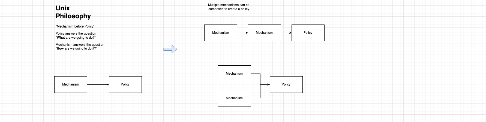
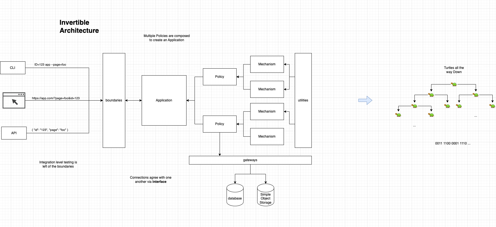
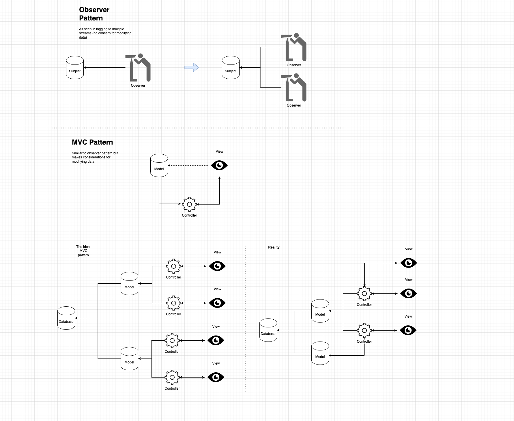
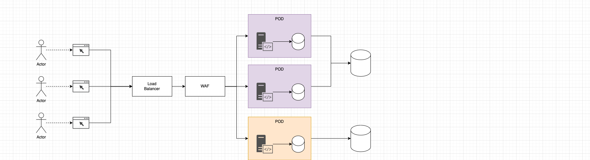

# Design

> When a program is being tested, it is too late to make design changes ~TAO of Programming

## Links

- [Unix Philosophy](./unix.md)
- [Twelve Factor Application](https://12factor.net/)

## See also

- [List of Software Development Philosophies](https://en.wikipedia.org/wiki/List_of_software_development_philosophies)
- [Martin Fowler](https://martinfowler.com)
- [Mythical Man Month](https://en.wikipedia.org/wiki/The_Mythical_Man-Month)

## Unix Design Philosophy

- Separate Mechanism from Policy
  - **Policy** answers the question "**what** are we going to do?"
  - **Mechanism** answers the question "**how** are we going to do it?"
- Bottom up design
  - Mechanism before Policy

## Invertible architecture

- Application is composed of one or more policies
- Policies are composed of one or more mechanisms
  - Mechanisms can be easily swapped
    - Policy remains unchanged

## Model View Controller

- Extends the Observer Pattern
  - Makes consideration for modifying data

## Application Load Balancing (ALB)

- Uses additional technology layer
  - Not to be confused with a DNS load balancer
- Cannot have Web Application Firewall (WAF) without Load Balancing

