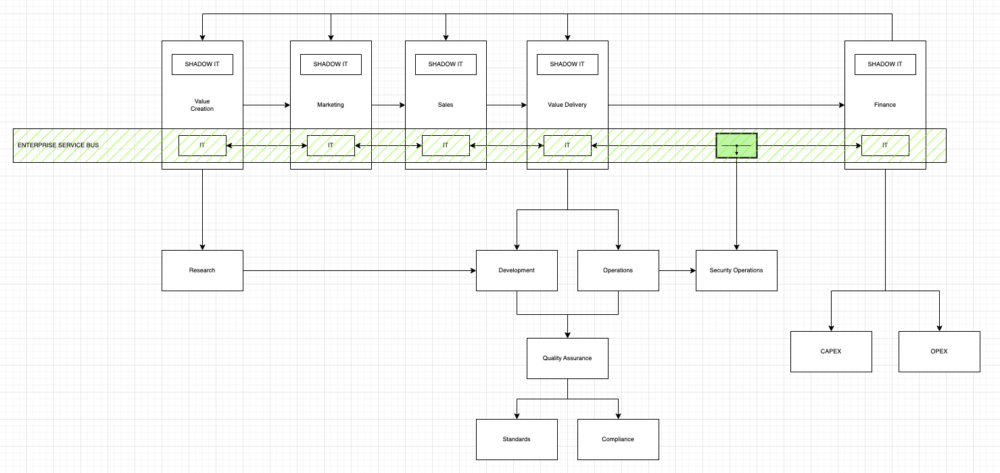
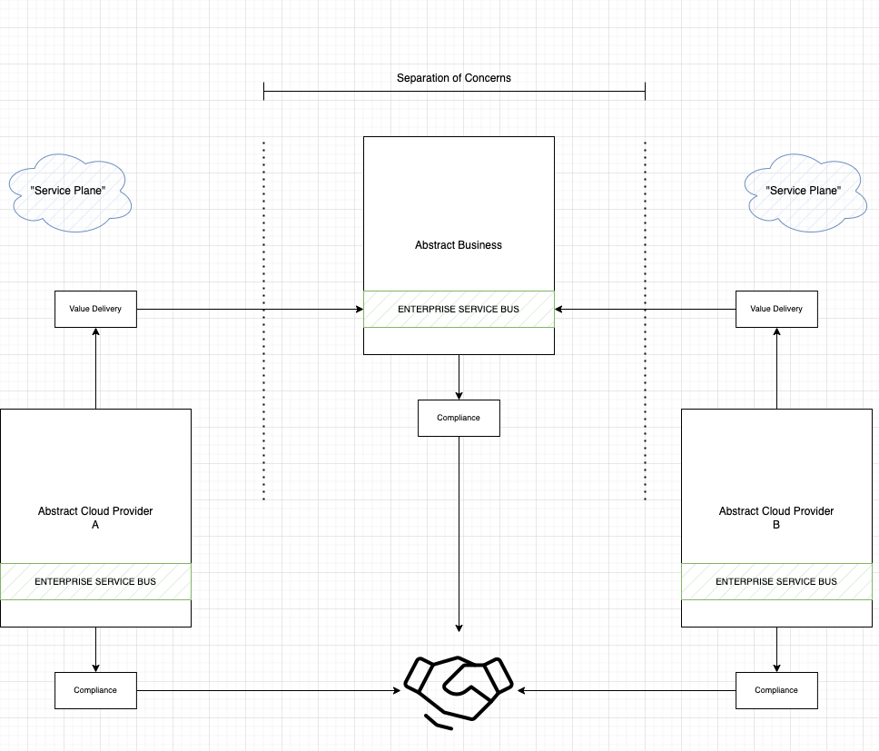

# Enterprise Service Bus (ESB)

> Fun fact. The Internet is an Enterprise Service Bus

Modeling an abstract business with five departments

1. Value creation
2. Marketing
3. Sales
4. Value delivery
5. Finance

Information flows into the organization and between departments using Information Technology (IT). Any IT that is not properly monitored is considered Shadow IT

An Enterprise Service Bus is an abstract concept, even though concrete implementations exist. An ESB collects, collates and aggregates information flowing through an organization. Collated data is forwarded to the Security Operations Center (SOC). IT that does not forward monitoring and logging information to the SOC is considered Shadow IT

An Enterprise Service Bus suffers from the Single Point of Failure (SPoF) flaw. To mitigate these risks, policies for separation of concerns are used. Possible mechanisms to implement such policies could be network segmentation or multi cloud infrastructures. These platforms must agree with compliance requirements and standards of the business

## Links

- [Enterprise Service Bus](https://en.wikipedia.org/wiki/Enterprise_service_bus)

## See also

- [Splunk basic searches](https://docs.splunk.com/Documentation/Splunk/9.0.4/SearchTutorial/Startsearching) (SOC Analyst view)
