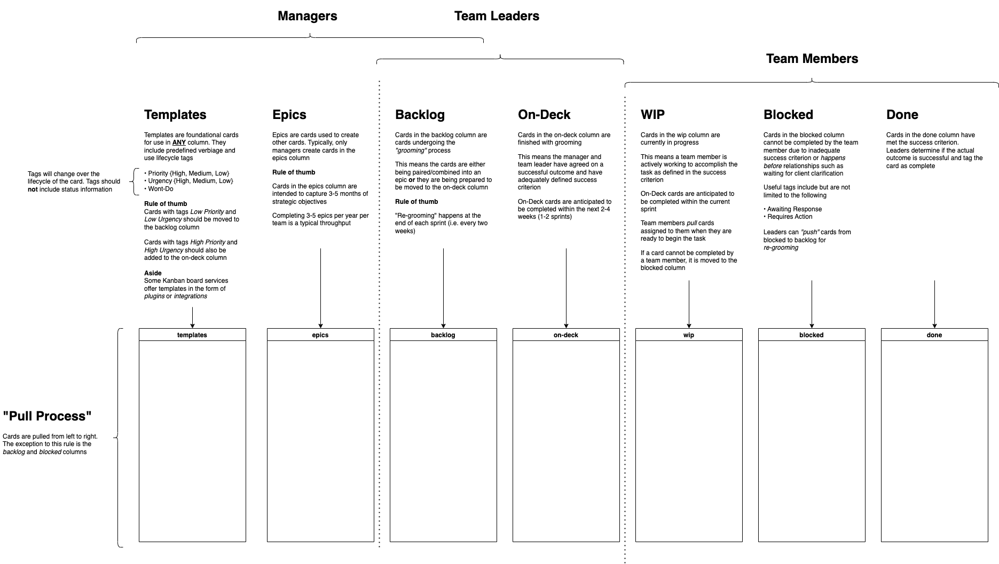

# Kanban

> Maximize the amount of work not done

Maximizing the amount of work not done means limiting the input to the system to the level at which the constraint in the processing system can process measurable work. The simplest way to do that is to allow downstream process steps to pull work, rather than pushing work into the system

## Links

- [Kanban](https://en.wikipedia.org/wiki/Kanban)

## See also

- [Leading Agile](https://www.leadingagile.com/2019/03/maximizing-the-amount-of-work-not-done)
